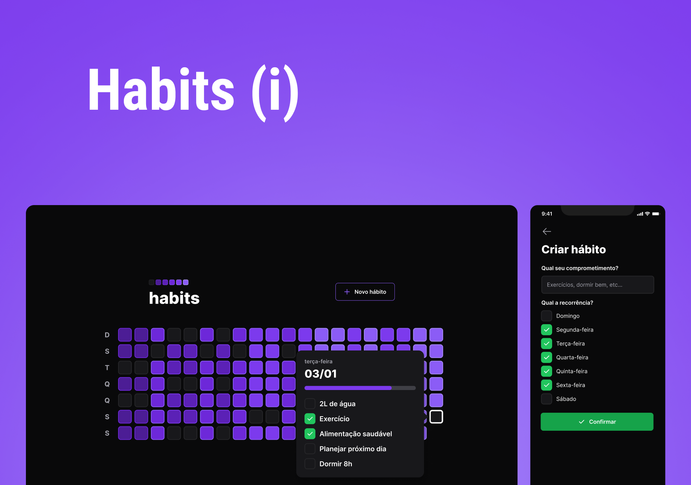

<h1 align="center">
  
</h1>

<h1 align="center">
  
</h1>

# Sobre o projeto

<p>
  Habits é um app para ajudar aos usuários a organizar sua rotina. Criar hábitos e dar aquela forcinha para conclui-lás.
</p>

# Tecnologias

- [React Native](https://reactnative.dev/)
- [React Native Reanimated](https://docs.expo.dev/versions/latest/sdk/reanimated/)
- [TypeScript](https://www.typescriptlang.org/)
- [Dayjs](https://day.js.org/)
- [Expo](https://expo.dev/)
- [Nativewind](https://www.nativewind.dev/)

## Como baixar o projeto

```bash
# Clonar o repositório
$ git clone https://github.com/wellingtonrodriguesbr/my-habits-mobile.git

# Entrar no diretório
$ cd my-habits-mobile


# Instalar as dependências
$ npm install

# Rodar o projeto
$ npx expo start
```

<br/>
<hr/>

<p align="center">Desenvolvido por <a href="https://www.linkedin.com/in/wellingtonrodriguesbr/" target="_blank">Wellington Rodrigues</a> ✌🏽</p>
